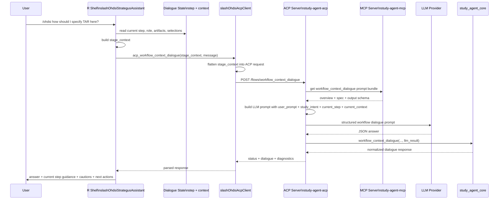

# WORKFLOW_CONTEXT_DIALOGUE_SLASH_OHDSI

This document summarizes the foundational data contract and implementation path for the contextualized AI workflow query capability exposed to users as `/ohdsi`.

The key idea is:

- the client workflow shell (e.g., the R shells for incidence rate analysis or cohort method) maintain *step-aware study-design context*
- the client can inject information and suggestions specific to the step where the user makes a `/ohdsi` request
- that context is flattened into a compact ACP flow request
- ACP fetches the workflow-dialogue prompt bundle from MCP
- ACP calls the LLM with the user question plus workflow context
- the structured answer is normalized and rendered back into the shell

## Purpose

`/ohdsi` is intended to answer workflow-aware OHDSI study-design questions in context, not as a generic assistant.

Examples:

- why are these phenotype recommendations weak here?
- how should I think about time at risk in this incidence design?
- what is the main risk in this cohort-method analytic setting?
- how will this Keeper step affect downstream artifacts?
- how would the data quality metrics for this data source influence this study design?
- should I use a more restrictive adjustment set than the defaults provided?
- help me to think about the set of mediators, confounders, and colliders for the outcome of interest
- ...any other question relevant as the user builds their study design

The answer should be tied to:

- the current workflow type
- the current step
- the active role when relevant
- the already-selected cohorts/statements/artifacts available at that step

## ACP Request Shape

The ACP flow endpoint is:

- `/flows/workflow_context_dialogue`

The effective request body is:

```json
{
  "user_prompt": "string, required",
  "study_intent": "string",
  "workflow_type": "string",
  "current_step": "string",
  "current_role": "string",
  "current_context": {
    "...": "flexible workflow-specific context object"
  }
}
```

## Optional Client Interaction Profile

A client may include an `interaction_profile` inside `current_context` to declare
its deterministic capabilities. This is a structured capability contract, not
free-form client instructions and not user content. ACP may use it to describe
available workflow paths, while the client remains responsible for rendering its
own controls.

For example, Atlas declares that it can request a bounded local-vocabulary
proposal, supports manual concept search, and can initialize `Selected` only
when the user explicitly elects review:

```json
{
  "interaction_profile": {
    "bounded_proposal": {
      "available": true,
      "local_vocabulary_search": true,
      "application": "selected_review"
    },
    "manual_concept_search": {
      "available": true
    }
  }
}
```

A shell that does not expose the proposal workflow simply omits this profile.
The declaration does not authorize automatic expression changes; a proposal is
review material until the client’s explicit approval action applies it.

## Required vs Practical Fields

Strictly required by the core typed model:

- `user_prompt`

Strongly expected for useful contextual answers:

- `study_intent`
- `workflow_type`
- `current_step`
- `current_context`

If context is sparse, ACP still returns a conservative answer rather than failing.

## Typed Core Input Model

The typed input contract is defined in:

- [core/study_agent_core/models.py](core/study_agent_core/models.py)

Relevant model:

```python
class WorkflowContextDialogueInput(BaseModel):
    user_prompt: str
    study_intent: str = ""
    workflow_type: str = ""
    current_step: str = ""
    current_role: str = ""
    current_context: Dict[str, Any] = Field(default_factory=dict)
    llm_result: Optional[Dict[str, Any]] = None
```

## Controlled `current_step` Vocabulary

The workflow shells normalize local step names into a controlled set of step identifiers.

Supported values:

- `study_intent_capture`
- `intent_split`
- `target_selection`
- `comparator_selection`
- `outcome_selection`
- `phenotype_review`
- `keeper_concept_set_generation`
- `keeper_case_review`
- `analytic_settings_collection`
- `cohort_method_spec_recommendation`
- `cohort_method_spec_confirmation`
- `incidence_design_setup`
- `time_at_risk_configuration`
- `workflow_summary`

Example definition and validation in:

- [workflow_stage_context.R](https://github.com/OHDSI/SlashOhdsiStrategusAssistant/blob/main/R/workflow_stage_context.R)

Example normalization from shell-local names in:

- [workflow_dialogue_mapping.R](https://github.com/OHDSI/SlashOhdsiStrategusAssistant/blob/main/R/workflow_dialogue_mapping.R)

## `workflow_type`

Although any client could leverage this (e.g., `study-agent-demo-shell`, a Python, or no code environment), currently the shells within R are the most developed:

- `strategus_incidence`
- `strategus_cohort_methods`

These are assigned in:

- [workflow_dialogue_mapping.R](https://github.com/OHDSI/SlashOhdsiStrategusAssistant/blob/main/R/workflow_dialogue_mapping.R)

## Stage Context on the R Side

Before ACP is called, the shell builds a richer `stage_context` object.

Base structure:

```r
list(
  contract_version = 1L,
  workflow_type = "strategus_incidence" | "strategus_cohort_methods",
  current_step = "...controlled step id...",
  step_label = "Human readable step label",
  user_goal = "study intent",
  entities = list(...),
  available_artifacts = list(...),
  dialogue = list(...),
  constraints = list(...)
)
```

Builder and validator:

- [workflow_stage_context.R](https://github.com/OHDSI/SlashOhdsiStrategusAssistant/blob/main/R/workflow_stage_context.R)

## Important `stage_context` Substructures

### `entities`

Typically contains role-aware workflow entities such as:

- `active_role`
- `role_statement`
- `target`
- `comparator`
- `outcomes`

### `available_artifacts`

Typically contains artifact references such as:

- `selected_target_ids`
- `selected_comparator_ids`
- `selected_outcome_ids`
- `analysis_settings_path`
- `concept_set_paths`

### `dialogue`

Contains dialogue history summaries:

- `prior_questions`
- `prior_answers`
- `last_user_message`

### `constraints`

Typical flags:

- `interactive`
- `allow_recommendations`
- `allow_generation`

## What ACP Actually Receives

ACP does not receive the raw `stage_context` object directly.

The R ACP wrapper flattens the richer stage context into the simpler request body used by `/flows/workflow_context_dialogue`.

Flattening happens in:

- [flows.R](https://github.com/OHDSI/SlashOhdsiAcpClient/blob/main/R/flows.R)

Key behavior:

- `study_intent` is taken from `stage_context$user_goal`
- `workflow_type` is taken from `stage_context$workflow_type`
- `current_step` is taken from `stage_context$current_step`
- `current_role` is derived from `active_role`
- `current_context` is built from:
  - shell `legacy_context`
  - `contract_version`
  - `step_label`
  - `entities`
  - `available_artifacts`
  - `prior_questions`
  - `prior_answers`
  - `constraints`

The flattening helper is:

- `.flatten_workflow_context_dialogue_payload(...)`

## Typical `current_context` Fields

`current_context` is intentionally flexible. Common fields include:

General:

- `contract_version`
- `step_label`
- `active_role`
- `role_statement`
- `target_statement`
- `comparator_statement`
- `outcome_statement`
- `outcome_statements`
- `selected_target_ids`
- `selected_comparator_ids`
- `selected_outcome_ids`
- `analysis_settings_path`
- `concept_set_paths`
- `prior_questions`
- `prior_answers`
- `constraints`

Incidence-specific examples:

- `top_k`
- `max_results`
- `candidate_limit`
- `suggested_cohort_id_base`
- `denominator_guidance`
- `time_at_risk_settings_path`
- `incidence_time_at_risk`
- `keeper_concept_set_state_path`
- `keeper_case_review_state_path`
- `review_roles`
- `review_status`

Cohort-method-specific examples:

- `target_statement`
- `comparator_statement`
- `outcome_statements`
- `analysis_settings_path`
- stepwise analytic-setting values in progress

## ACP Endpoint Handling

The ACP HTTP handler reads the workflow-dialogue request here:

- [acp_agent/study_agent_acp/server.py](acp_agent/study_agent_acp/server.py)

It extracts:

- `user_prompt`
- `study_intent`
- `workflow_type`
- `current_step`
- `current_role`
- `current_context`

And calls:

- `run_workflow_context_dialogue_flow(...)`

## ACP Flow Implementation

The ACP workflow-dialogue flow is implemented here:

- [acp_agent/study_agent_acp/agent.py](acp_agent/study_agent_acp/agent.py)

Behavior:

1. validate presence of `user_prompt`
2. fetch the MCP prompt bundle named `workflow_context_dialogue`
3. build the LLM prompt from:
   - `user_prompt`
   - `study_intent`
   - `workflow_type`
   - `current_step`
   - `current_role`
   - `current_context`
4. call the LLM with required output keys
5. pass the LLM payload into the core `workflow_context_dialogue(...)` function
6. return the normalized dialogue response plus diagnostics

## MCP’s Role

For `/ohdsi`, MCP does not answer the question directly.

MCP supplies the prompt bundle for the workflow-dialogue task.

Implementation:

- [mcp_server/study_agent_mcp/tools/workflow_context_dialogue.py](mcp_server/study_agent_mcp/tools/workflow_context_dialogue.py)

Prompt assets:

- [mcp_server/prompts/workflow_dialogue/overview_workflow_context_dialogue.md](mcp_server/prompts/workflow_dialogue/overview_workflow_context_dialogue.md)
- [mcp_server/prompts/workflow_dialogue/spec_workflow_context_dialogue.md](mcp_server/prompts/workflow_dialogue/spec_workflow_context_dialogue.md)
- [mcp_server/prompts/workflow_dialogue/output_schema_workflow_context_dialogue.json](mcp_server/prompts/workflow_dialogue/output_schema_workflow_context_dialogue.json)

## LLM Prompt Assembly

ACP builds a single prompt containing:

- overview prompt text
- JSON output schema
- dynamic input JSON
- strict output rules

Prompt builder:

- [acp_agent/study_agent_acp/llm_client.py](acp_agent/study_agent_acp/llm_client.py)

Dynamic input fields sent to the LLM:

```json
{
  "task": "workflow_context_dialogue",
  "user_prompt": "...",
  "study_intent": "...",
  "workflow_type": "...",
  "current_step": "...",
  "current_role": "...",
  "current_context": { ... }
}
```

## Core Output Contract

The expected structured output is:

```json
{
  "plan": "string <=300 chars",
  "answer": "string <=1200 chars",
  "current_step_guidance": ["string <=200 chars"],
  "cautions": ["string <=200 chars"],
  "suggested_next_actions": ["string <=200 chars"]
}
```

Specified in:

- [mcp_server/prompts/workflow_dialogue/spec_workflow_context_dialogue.md](mcp_server/prompts/workflow_dialogue/spec_workflow_context_dialogue.md)
- [mcp_server/prompts/workflow_dialogue/output_schema_workflow_context_dialogue.json](mcp_server/prompts/workflow_dialogue/output_schema_workflow_context_dialogue.json)

Core normalization and fallback are implemented in:

- [core/study_agent_core/tools.py](core/study_agent_core/tools.py)

If no usable LLM payload is available, the system returns a conservative stub answer instead of failing.

## Shell Integration

The interactive R shells create a dialogue session object that:

- tracks the current step and role
- updates context before prompts
- intercepts `/ohdsi ...` user input
- sends the flattened payload to ACP
- renders the structured response back to the console

Key implementation:

- [workflow_dialogue.R](https://github.com/OHDSI/SlashOhdsiStrategusAssistant/blob/main/R/workflow_dialogue.R)
- [slash_ohdsi_runtime.R](https://github.com/OHDSI/SlashOhdsiStrategusAssistant/blob/main/R/slash_ohdsi_runtime.R)
- [strategus_incidence_shell.R](https://github.com/OHDSI/SlashOhdsiStrategusAssistant/blob/main/R/strategus_incidence_shell.R)
- [strategus_cohort_methods_shell.R](https://github.com/OHDSI/SlashOhdsiStrategusAssistant/blob/main/R/strategus_cohort_methods_shell.R)

## Mermaid Sequence Diagram



## Most Important Implementation Seams

If you need the shortest possible map of the `/ohdsi` architecture, start here:

- R-side stage context definition:
  - [workflow_stage_context.R](https://github.com/OHDSI/SlashOhdsiStrategusAssistant/blob/main/R/workflow_stage_context.R)
- R-side workflow mapping and context construction:
  - [workflow_dialogue_mapping.R](https://github.com/OHDSI/SlashOhdsiStrategusAssistant/blob/main/R/workflow_dialogue_mapping.R)
- R-to-ACP payload flattening:
  - [flows.R](https://github.com/OHDSI/SlashOhdsiAcpClient/blob/main/R/flows.R)
- ACP HTTP endpoint:
  - [acp_agent/study_agent_acp/server.py](acp_agent/study_agent_acp/server.py)
- ACP workflow-dialogue flow:
  - [acp_agent/study_agent_acp/agent.py](acp_agent/study_agent_acp/agent.py)
- ACP prompt builder:
  - [acp_agent/study_agent_acp/llm_client.py](acp_agent/study_agent_acp/llm_client.py)
- Core typed input and fallback behavior:
  - [core/study_agent_core/models.py](core/study_agent_core/models.py)
  - [core/study_agent_core/tools.py](core/study_agent_core/tools.py)
- MCP prompt bundle source:
  - [mcp_server/study_agent_mcp/tools/workflow_context_dialogue.py](mcp_server/study_agent_mcp/tools/workflow_context_dialogue.py)

## Practical Summary

The most important design choice is that `/ohdsi` is not driven by raw transcripts alone. It is driven by a structured, step-aware context object built by the shells and flattened into a stable ACP request shape.

For execution-mode requests, that structured context now includes not only the current step, summarized artifacts, and approved exploration commands, but also any optional workflow steps the user intentionally skipped. This lets ACP distinguish between missing context caused by a skipped review/enrichment step and missing context caused by an execution failure or an unfinished workflow.

That separation gives the project three advantages:

- shells control what context is exposed
- ACP remains workflow-aware without being shell-specific
- MCP prompt bundles define the dialogue contract independently of shell code

## Atlas Concept-Set Review Workflow

Atlas uses the same `workflow_context_dialogue` flow for `/ohdsi` concept-set
assistance, with WebAPI as the browser-facing boundary. ACP and MCP are never
called directly by the browser.

The supported authoring sequence is review-gated:

1. Start `/ohdsi` with a concept-set goal and resolve any scope questions.
2. The user may use Atlas search manually or request a bounded local-vocabulary
   proposal.
3. A proposal is review material only. It presents the bounded retrieval
   provenance, candidates, and a provisional policy; it does not alter Selected.
4. For a new empty draft, the user may explicitly initialize Selected, inspect
   Included, and save through the normal Atlas workflow.
5. For an existing saved set, the saved Selected expression is the base. Atlas
   displays a deterministic change summary and the user explicitly merges the
   validated result into Selected before reviewing Included and saving.

Technical validation is necessary but not clinical approval. The user remains
responsible for reviewing terminology, scope, descendants, mappings, and the
resolved Included extension.

### Provenance and edited expressions

WebAPI stores review revisions and links a normal Atlas save only when the
persisted Selected policy exactly matches the reviewed expression. If a user
edits Selected after `/ohdsi` approval—for example, toggles descendants—the
Atlas save still succeeds, but provenance finalization fails closed. The set is
not represented as matching the prior `/ohdsi` review.

When reopening a saved set, Atlas requests concise, user-owned `/ohdsi`
provenance (last goal and review revision) from WebAPI. It is displayed as
background for a new refinement dialogue; prior assistant advice is not
silently resumed as an instruction.
